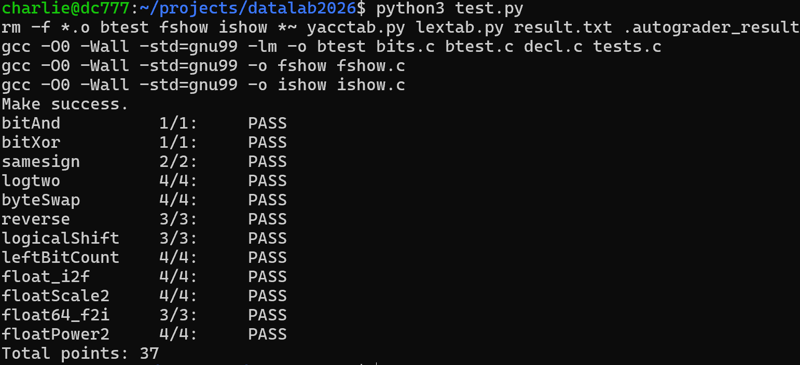

# datalab 报告

姓名：刘恒
学号：2025201688

总分：**37/37**（`python3 test.py`，12 题全部通过）。

| 题目 | 得分 | 题目 | 得分 |
| :--- | :---: | :--- | :---: |
| bitAnd | 1/1 | logicalShift | 3/3 |
| bitXor | 1/1 | leftBitCount | 4/4 |
| samesign | 2/2 | float_i2f | 4/4 |
| logtwo | 4/4 | floatScale2 | 4/4 |
| byteSwap | 4/4 | float64_f2i | 3/3 |
| reverse | 3/3 | floatPower2 | 4/4 |

test 截图：



## 解题报告

### 亮点

1. `logtwo`：按 16、8、4、2、1 位逐步定位最高有效位。
2. `byteSwap`：用掩码提取字节，清空原位置后交叉写回。
3. `float_i2f`：在整数转浮点数时处理尾数截取和最近偶数舍入。

### bitAnd

```c
int bitAnd(int x, int y) {
    return ~(~x | ~y);
}
```

根据德摩根律，`x & y` 可以改写为 `~(~x | ~y)`。先分别取反，再按位或并整体取反，就只用题目允许的运算符实现了按位与。

### bitXor

```c
int bitXor(int x, int y) {
    return ~(x & y) & ~(~x & ~y);
}
```

异或的结果位为 1，当且仅当两个输入位不同。代码用 `~(x & y)` 排除同时为 1 的情况，用 `~(~x & ~y)` 排除同时为 0 的情况，最后将两者相与。

### samesign

```c
int samesign(int x, int y) {
    if ((x ^ y) >> 31) {
        return 0;
    }
    if (x && y) {
        return 1;
    }
    if (!x && !y) {
        return 1;
    }
    return 0;
}
```

两个非零整数异号时，`x ^ y` 的最高位为 1，因此可以先检查它。零需要单独判断：两个零返回 1，只有一个数为零时返回 0。

### logtwo

```c
int logtwo(int v) {
    int r = (v > 65535) << 4;
    r = r | (((v >> r) > 255) << 3);
    r = r | (((v >> r) > 15) << 2);
    r = r | (((v >> r) > 3) << 1);
    r = r | ((v >> r) > 1);
    return r;
}
```

对正整数，`logtwo` 的结果是最高有效位的下标。代码先判断该位是否在高 16 位，再按 8、4、2、1 位逐步缩小范围并累加偏移量，例如 `32` 得到 `5`。

### byteSwap

```c
int byteSwap(int x, int n, int m) {
    n = n << 3;
    m = m << 3;
    int c = (x >> n) & 255;
    int d = (x >> m) & 255;
    x = x ^ (c << n);
    x = x | (d << n);
    x = x ^ (d << m);
    x = x | (c << m);
    return x;
}
```

字节编号乘 8 后就是对应字节的位移量，右移并与 `255` 相与即可取出目标字节。随后用异或清空原位置，再用按位或交叉写回；交换同一个字节时结果不变。

### reverse

```c
unsigned reverse(unsigned v) {
    unsigned r = 0;
    unsigned i = 32;

    while (i) {
        r = (r << 1) | (v & 1);
        v = v >> 1;
        i = i - 1;
    }

    return r;
}
```

每轮取出 `v` 的最低位，将结果 `r` 左移，再把这一位接到 `r` 的末尾。重复 32 次后，原数从低到高的各位依次写入结果，因此位序被反转。

### logicalShift

```c
int logicalShift(int x, int n) {
    int y = x & (1 << 31);
    x = x >> n;
    y = y >> n;
    y = y << 1;
    x = y ^ x;
    return x;
}
```

有符号整数右移时，负数左端可能补入 1，而逻辑右移应补入 0。代码根据原最高位生成补位掩码，再用异或清除这些 1；当 `n == 0` 时掩码为 0。

### leftBitCount

```c
int leftBitCount(int x) {
    int y = ((1 << 31) & x) >> 31;
    x = ~x;
    int b16 = !!(x >> 15) << 4;
    x = x >> b16;
    int b8 = !!(x >> 7) << 3;
    x = x >> b8;
    int b4 = !!(x >> 3) << 2;
    x = x >> b4;
    int b2 = !!(x >> 1) << 1;
    x = x >> b2;
    int b1 = x;
    int b = b16 + b8 + b4 + b2 + b1;
    int an = 32 + (~b + 1);
    return an & y;
}
```

取反后，原数左端连续的 1 变成连续的 0，因此问题转为求取反值的前导零个数。代码按 16、8、4、2 位分段定位最高的 1；若原数最高位为 0，则最后用掩码返回 0。

### float_i2f

```c
unsigned float_i2f(int x) {
    int a, i, b, j;
    b = 1 << 31;
    a = b & x;
    if (a) {
        x = ~x + 1;
    }
    for (i = 1; i < 33; i = i + 1) {
        if (x & b) {
            j = ~b & x;
            a = a | ((159 - i) << 23);
            if (i > 8) {
                a = a | (j << (i - 9));
            } else {
                int s = 9 - i;
                int mask = (1 << s) + ~0;
                int rest = mask & j;
                int half = 1 << (s - 1);
                a = a | (j >> s);
                if (rest + (a & 1) > half) {
                    a = a + 1;
                }
            }
            break;
        }
        b = b >> 1;
    }
    return a;
}
```

先保留符号，并根据整数绝对值的最高有效位确定浮点数的阶码和尾数。尾数需要截断时，比较被舍弃部分与一半的大小；恰好一半时仅对奇数尾数进位，以实现舍入到最近偶数。

### floatScale2

```c
unsigned floatScale2(unsigned uf) {
    unsigned exp = (uf >> 23) & 0xFF;
    if (exp == 255) {
        return uf;
    }
    if (exp == 0) {
        return (uf & 0x80000000) |
               ((uf & 0x7FFFFFFF) << 1);
    }
    if (exp == 254) {
        return (uf & 0x80000000) | 0x7F800000;
    }
    return uf + (1 << 23);
}
```

先取出阶码，遇到 NaN 或无穷大就保留原位模式。阶码为 0 时左移数值部分，其余有限值将阶码加 1；原阶码为 254 时结果变为相应符号的无穷大。

### float64_f2i

```c
int float64_f2i(unsigned uf1, unsigned uf2) {
    int sn = (1 << 31) & uf2;
    int a = (uf2 >> 20) & 0x000007FF;
    if (a < 1023) {
        return 0;
    }
    if (a > 1053) {
        return 0x80000000;
    }
    int n = a - 1023;
    int an = 1 << n;
    if (n <= 20) {
        an = an | ((uf2 >> (20 - n)) & (~0 + (1 << n)));
    } else {
        an = an | ((uf2 & (~0 + (1 << 20))) << (n - 20));
        an = an | ((uf1 >> (52 - n)) & (~0 + (1 << (n - 20))));
    }
    if (sn) {
        an = ~an + 1;
    }
    return an;
}
```

先从高 32 位提取符号和阶码，再把高、低两部分尾数中属于整数的位组合起来。绝对值小于 1 时返回 0，指数超出代码处理的整数范围时返回 `0x80000000`，其余情况截去小数位并恢复符号。

### floatPower2

```c
unsigned floatPower2(int x) {
    if (x > 127) {
        return 0x7F800000;
    }
    if (x < -149) {
        return 0;
    }
    if (x >= -126) {
        return (127 + x) << 23;
    }
    return 1 << (x + 149);
}
```

`2^x` 的位模式主要由指数决定，因此按 `x` 所在范围分别处理。过大时返回正无穷，过小时返回 0；正常范围写入带偏置的阶码，非规格化范围则设置尾数中的对应位。

## 反馈/收获/感悟/总结

这次实验中有几道题让我花了较长时间思考，也让我更熟悉了补码、移位和掩码的用法。整数题的难点是用有限的运算符组合出所需操作；浮点题则要分清符号、阶码和尾数，并留意舍入与边界情况。零、极值和范围交界处的输入也值得重点检查。

## 参考的重要资料

无
